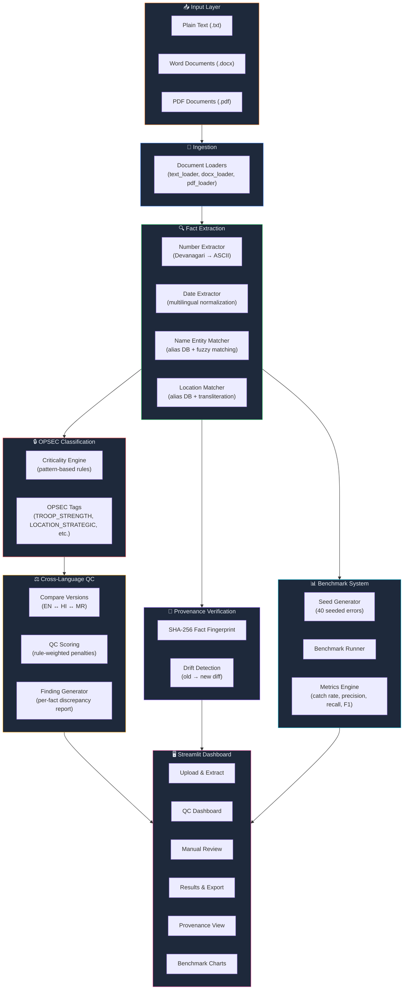
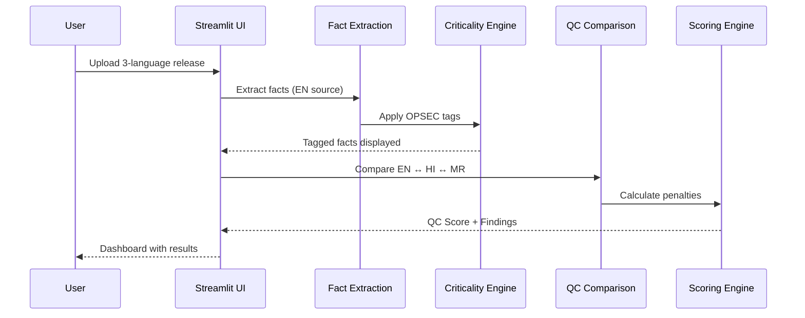

# FACTSHIELD — Architecture

## System Architecture

## Data Flow

## Key Design Decisions

| Decision | Rationale |
|----------|-----------|
| **No LLMs for matching** | Deterministic rules ensure reproducibility and explainability — critical for military QC |
| **Dictionary-first name matching** | Alias DB with 5 canonical names × 7+ forms each ensures precise identity resolution |
| **Devanagari ↔ ASCII normalization** | Numbers like `२५०` are normalized to `250` before comparison — eliminates script-specific false negatives |
| **Seeded-error benchmarking** | 40 programmatic mutations per release create a labeled test suite without manual annotation |
| **SHA-256 fact fingerprinting** | Provenance verification is tamper-evident — any single fact change breaks the fingerprint |
| **Rule-based criticality** | Pattern matching against military vocabulary classifies facts by operational sensitivity |
